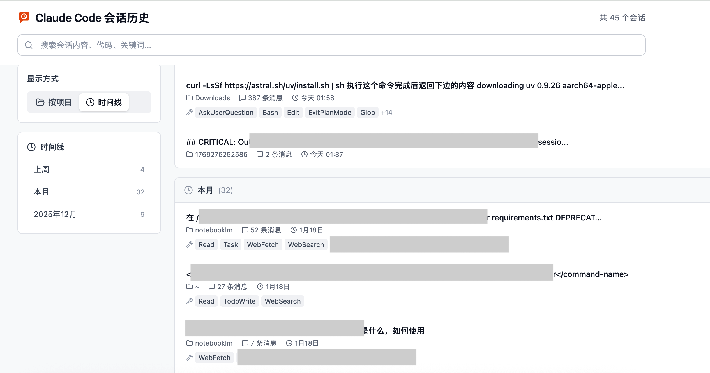
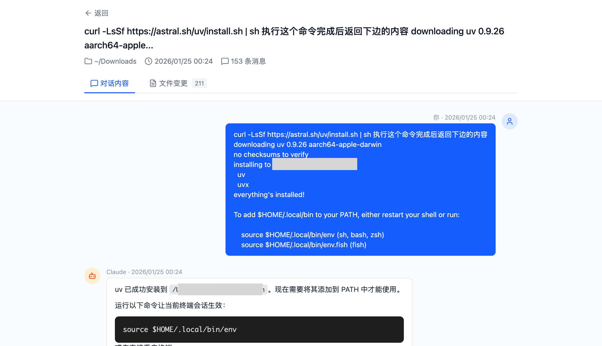
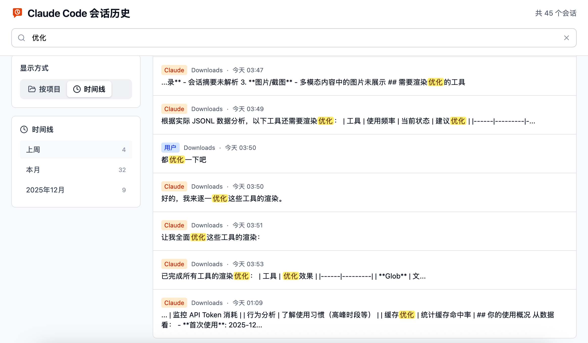

# Claude Session Viewer

一个用于浏览和搜索 Claude Code 历史会话的 Web 可视化工具。



## 功能特性

- **时间线模式** - 跨项目按时间倒序浏览所有会话，支持日期分组导航
- **项目筛选** - 按工作目录筛选会话
- **全文搜索** - 搜索会话中的关键词、代码片段，结果高亮显示
- **会话详情** - 查看完整对话内容，支持 Markdown 渲染
- **工具调用可视化** - 优化的工具调用展示
  - Edit 工具：Git Diff 风格对比
  - Read/Write 工具：代码高亮 + 行号
  - Task 工具：Markdown 渲染
  - Glob/Grep：文件列表展示
  - WebFetch/WebSearch：URL 预览 + 结果展示
- **文件变更追踪** - 查看每个会话修改了哪些文件
- **一键复制** - Claude 回复支持一键复制

## 技术栈

### 后端
- Python 3.10+
- FastAPI
- Pydantic

### 前端
- React 19 + TypeScript
- Tailwind CSS
- Vite
- react-markdown

## 快速开始

### 方式一：一键启动（推荐）

```bash
# 克隆项目
cd claude-session-viewer

# 一键启动（自动安装依赖、启动前后端、打开浏览器）
./start.sh
```

### 方式二：手动启动

#### 1. 启动后端

```bash
cd backend

# 创建虚拟环境并安装依赖
python3 -m venv .venv
source .venv/bin/activate
pip install -r requirements.txt

# 启动服务
uvicorn main:app --port 8000 --reload
```

#### 2. 启动前端

```bash
cd frontend

# 安装依赖
npm install

# 启动开发服务器
npm run dev
```

#### 3. 访问应用

打开浏览器访问 http://localhost:5173

## 项目结构

```
claude-session-viewer/
├── backend/
│   ├── main.py              # FastAPI 入口
│   ├── parser.py            # JSONL 解析器
│   ├── models.py            # Pydantic 数据模型
│   └── requirements.txt     # Python 依赖
├── frontend/
│   ├── src/
│   │   ├── components/      # React 组件
│   │   │   ├── MessageBubble.tsx   # 消息气泡（含工具渲染）
│   │   │   ├── DiffViewer.tsx      # Git Diff 视图
│   │   │   ├── CodeViewer.tsx      # 代码查看器
│   │   │   ├── TimelineView.tsx    # 时间线视图
│   │   │   └── ...
│   │   ├── pages/           # 页面组件
│   │   └── lib/             # 工具函数和 API
│   └── package.json
├── start.sh                 # 一键启动脚本
├── stop.sh                  # 停止脚本
└── README.md
```

## API 接口

| 方法 | 路径 | 说明 |
|------|------|------|
| GET | `/api/sessions` | 获取会话列表 |
| GET | `/api/sessions/{id}` | 获取会话详情 |
| GET | `/api/search?q=keyword` | 全文搜索 |
| GET | `/api/projects` | 获取项目列表 |

## 数据来源

本工具读取 Claude Code 的本地存储数据（只读，不会修改任何数据）：

```
~/.claude/
├── projects/           # 会话数据（JSONL 格式）
│   └── {project}/
│       └── {uuid}.jsonl
└── file-history/       # 文件变更备份
    └── {session}/
        └── {hash}@v{n}
```

## 截图

### 时间线模式


### 会话详情


### 搜索功能


## 开发计划

- [ ] AI 生成会话摘要
- [ ] 导出为 Markdown
- [ ] 会话标签管理
- [ ] 深色模式
- [ ] Docker 部署支持

## 相关项目

- [ccusage](https://github.com/ryoppippi/ccusage) - Claude Code Token 用量统计工具

## License

MIT
